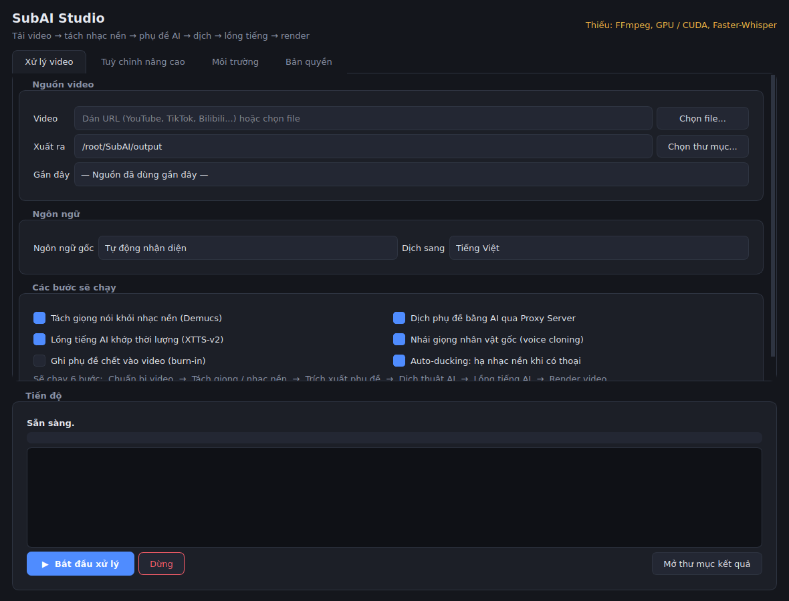
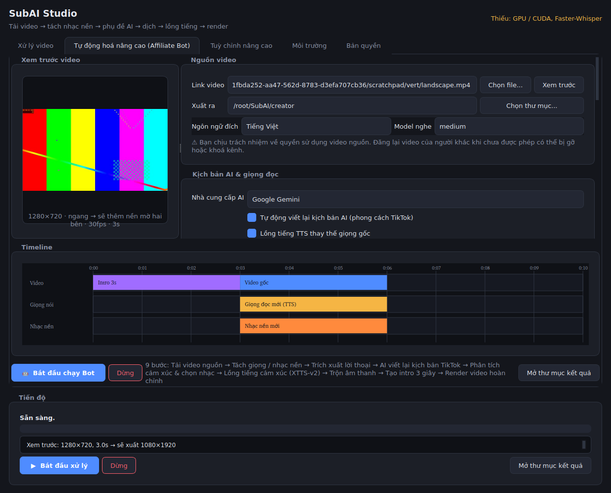
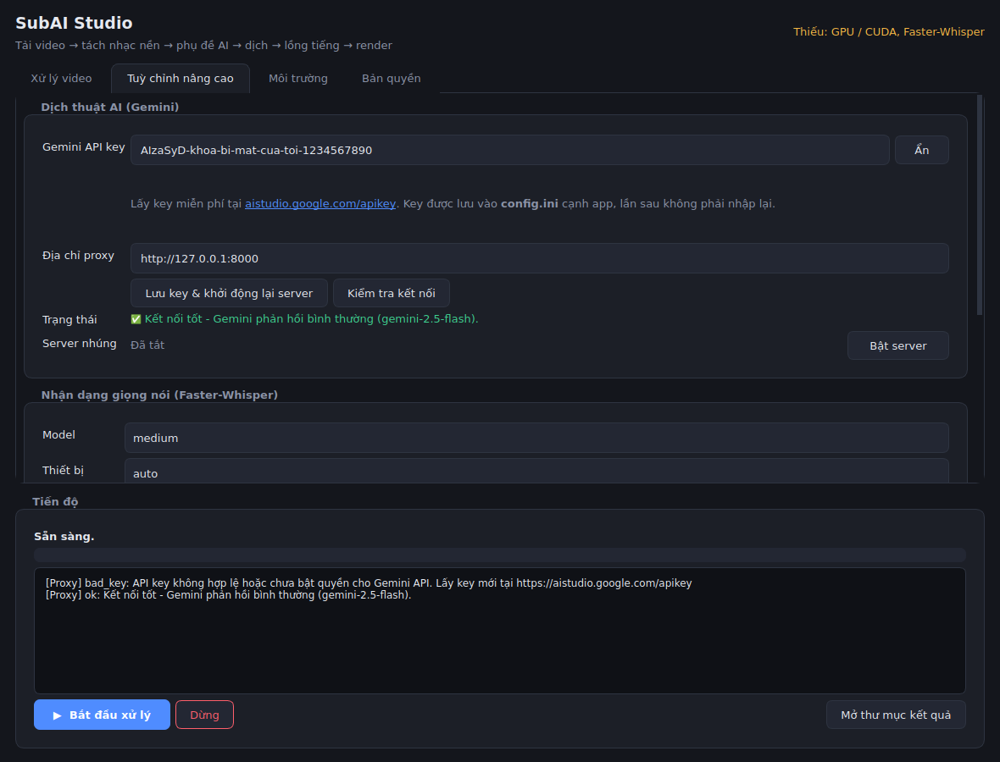

# SubAI Studio — Desktop App Lồng Tiếng & Phụ Đề AI

Ứng dụng desktop (Windows / Linux / macOS) tự động hoá toàn bộ quy trình bản địa hoá
video: tải video → tách giọng khỏi nhạc nền → trích xuất phụ đề → dịch AI → lồng tiếng
nhái giọng gốc → render video hoàn chỉnh. Tất cả chạy trong một cửa sổ, không cần gõ lệnh.



## 🌟 Tính Năng

| Tính năng | Công nghệ |
|---|---|
| Tải video đa nền tảng (YouTube, TikTok, Douyin, Bilibili…) | `yt-dlp` |
| Tách vocal / nhạc nền để ASR chính xác hơn | Demucs HTDemucs v4 |
| Trích xuất phụ đề tốc độ cao, lọc khoảng lặng | Faster-Whisper + Silero VAD |
| Dịch giữ văn phong, không lệch số dòng | **Gemini / ChatGPT / DeepSeek** qua Proxy Server |
| Lồng tiếng nhái giọng nhân vật gốc, khớp mốc thời gian | XTTS-v2 + time-stretch |
| Auto-ducking: hạ nhạc nền khi có lời thoại | FFmpeg `sidechaincompress` |
| Khoá bản quyền theo máy | HWID + chữ ký RSA-PSS |

Giao diện gồm 5 tab: **Xử lý video**, **Tự động hoá nâng cao (Affiliate Bot)**,
**Tuỳ chỉnh nâng cao**, **Môi trường** (báo engine nào đã sẵn sàng, engine nào thiếu và
lệnh cài), **Bản quyền** (HWID + license key).

## 🤖 Affiliate Bot

Dán link video → Bot chạy 9 bước → ra video TikTok đã lồng tiếng Việt, có intro 3 giây và
nhạc nền mới, rồi tự mở thư mục kết quả.

| Bước | Làm gì |
|---|---|
| Intro 3 giây | Tự nhập chữ, hoặc để AI nghĩ câu hook (nền gradient + chữ zoom) |
| Viết lại kịch bản | Prompt phong cách TikTok Gen Z, giữ nguyên mốc thời gian |
| Chọn nhạc | AI đoán cảm xúc video rồi chọn nhạc khớp từ thư viện của bạn |
| Trộn âm thanh | Auto-ducking, nhạc nền -15dB |
| Xem trước + Timeline | Frame đầu video, 3 track màu theo thời gian |
| Xuất bản | 9:16 1080×1920, CRF 18, preset slow, audio 192k |

Chi tiết: **[docs/AFFILIATE_BOT.md](docs/AFFILIATE_BOT.md)**



## ⚡ Chạy Nhanh

- **Windows**: nhấp đôi **`Start_SubAI.bat`**
- **Linux/macOS**: `./start_unix.sh`

Script tự tạo venv, cài thư viện, **tự bật server dịch thuật ngầm** rồi mở app —
không cần mở thêm cửa sổ CMD nào. Gặp lỗi thì chạy `python check_setup.py`.

Chọn nhà cung cấp AI và nhập API key ngay trong app (tab **Tuỳ chỉnh nâng cao**), lưu vào
`config.ini` nên chỉ phải nhập một lần — mỗi nhà cung cấp giữ key riêng:



## 🛠️ Cài Đặt

### Yêu cầu
- **OS**: Windows 10/11 64-bit, Ubuntu 22.04+, hoặc macOS 12+
- **Python**: 3.11 (bắt buộc — Coqui TTS chưa hỗ trợ 3.12+)
- **GPU**: NVIDIA ≥ 6GB VRAM + CUDA 12.1 (chạy CPU vẫn được nhưng rất chậm)
- **Bắt buộc**: FFmpeg trong PATH

### Cài nhanh

```bash
git clone https://github.com/vanhn-95/anhvan.git
cd anhvan

python3.11 -m venv venv         # Windows: py -3.11 -m venv venv
source venv/bin/activate        # Windows: venv\Scripts\activate

# PyTorch bản CUDA (bỏ qua nếu chỉ chạy CPU)
pip install torch torchaudio torchvision --index-url https://download.pytorch.org/whl/cu121

pip install -r requirements.txt

```

Chỉ muốn mở giao diện để xem trước, chưa cài engine AI nặng:

```bash
pip install -r requirements-desktop.txt
```

App vẫn mở bình thường — tab **Môi trường** sẽ chỉ rõ thiếu gì và cần cài lệnh nào.

📖 Hướng dẫn đầy đủ từng bước (FFmpeg, Rubber Band, `.env`, build `.exe`, các lỗi hay
gặp): **[docs/SETUP.md](docs/SETUP.md)**.

## 🚀 Sử Dụng

### 1. Mở app desktop

```bash
python run_desktop.py           # hoặc: python -m desktop
```

`run_desktop.py` tự bật Proxy Server dịch thuật bằng `subprocess` (trên Windows không
bung cửa sổ console) và tự tắt khi bạn đóng app. Lần đầu mở, vào tab **Tuỳ chỉnh nâng
cao** → chọn **Nhà cung cấp AI** → dán **API key** → chọn/gõ **Model** → bấm
**Lưu key && khởi động lại server**. Key được ghi vào `config.ini` theo từng nhà cung
cấp, lần sau tự điền lại.

| Nhà cung cấp | Model mặc định | Lấy key |
|---|---|---|
| Google Gemini | `gemini-2.5-flash` | [aistudio.google.com/apikey](https://aistudio.google.com/apikey) |
| ChatGPT (OpenAI) | `gpt-4o-mini` | [platform.openai.com/api-keys](https://platform.openai.com/api-keys) |
| DeepSeek | `deepseek-chat` | [platform.deepseek.com/api_keys](https://platform.deepseek.com/api_keys) |

Nút **Kiểm tra kết nối AI & Proxy** hiện hộp thoại phân biệt rõ từng nguyên nhân: proxy
chưa chạy, proxy chạy nhưng chưa có key, key sai, key hết quota, model không tồn tại, mất
mạng, hay nhà cung cấp đang lỗi.

### 2. Chạy Proxy Server riêng (tuỳ chọn)

Muốn đặt server trên máy khác thì tắt server nhúng trong `config.ini`
(`[proxy] auto_start = false`) rồi chạy thủ công:

```bash
export GEMINI_API_KEY="YOUR_KEY"
export SUBAI_LICENSES="key1,key2"      # tuỳ chọn: giới hạn client được phép gọi
uvicorn server.proxy_server:app --host 0.0.0.0 --port 8000
```

Hoặc bằng Docker:

```bash
docker build -t subai-proxy .
docker run -p 8000:8000 -e GEMINI_API_KEY="YOUR_KEY" subai-proxy
```

Dán URL (hoặc chọn file) → chọn ngôn ngữ đích → tick các bước cần chạy → **Bắt đầu xử lý**.
Tiến độ, log từng bước và nút **Dừng** nằm ngay dưới cùng cửa sổ.

Kết quả trong thư mục xuất:

```
<tên>.origin.srt          # phụ đề gốc
<tên>.vi.srt              # phụ đề đã dịch
<tên>.vi.dubbed.mp4       # video đã lồng tiếng (hoặc .sub.mp4 nếu chỉ làm phụ đề)
```

### 3. Chạy bằng dòng lệnh (tuỳ chọn)

```bash
python -m src.main_pipeline "https://youtu.be/xxxx" -t vi -o ~/SubAI/output
python -m src.main_pipeline video.mp4 --no-dub --burn      # chỉ phụ đề, ghi chết vào video
```

## 🧱 Kiến Trúc

```
desktop/     Giao diện PySide6 (app, cửa sổ chính, worker thread, theme, env check)
src/         Pipeline: downloader → separator → ASR → translator → TTS → composer
             providers.py: factory đa nhà cung cấp AI (Gemini/OpenAI/DeepSeek)
             creator_pipeline.py + intro_maker/script_writer/music_mixer: Affiliate Bot
             vertical_render.py: xuất 9:16 chất lượng cao
server/      FastAPI proxy giữ API key, gọi provider qua factory
tools/       Công cụ phát hành license (keygen / issue)
packaging/   PyInstaller spec để build bản .exe / .app
```

Pipeline chạy trong `QThread` riêng, giao tiếp với UI qua `ProgressReporter` → Qt signals,
nên cửa sổ không bao giờ bị đơ và có thể huỷ giữa chừng. Mọi engine AI được **import lazy**:
thiếu engine nào thì chỉ bước đó bị tắt, app vẫn chạy. Chi tiết: [docs/ARCHITECTURE.md](docs/ARCHITECTURE.md).

## 🧪 Test

```bash
pip install -r requirements-dev.txt
QT_QPA_PLATFORM=offscreen pytest
```

## 📦 Đóng Gói & Bảo Mật

Build bản chạy độc lập (spec đã kèm sẵn `--collect-all` cho toàn bộ thư viện AI nên
không dính `ModuleNotFoundError` lúc chạy file build):

```bash
pip install pyinstaller
pyinstaller packaging/subai_studio.spec --noconfirm
# -> dist/SubAIStudio/
```

Phát hành license theo máy:

```bash
python tools/license_tool.py keygen --out keys/
python tools/license_tool.py issue --key keys/private.pem \
    --hwid <HWID khách gửi> --customer "Tên khách" --expires 2027-01-01
```

Nhúng public key vào bản build client qua biến môi trường `SUBAI_PUBLIC_KEY`, và tắt chế
độ dev bằng `SUBAI_DEV_MODE=0`. Khi cần khoá chặt hơn:

```bash
cythonize -3 -i src/security_guard.py          # biên dịch module bảo mật sang C
pyarmor gen --output dist_protected src/*.py   # obfuscate mã nguồn
```

## 📄 License

Phát triển và sở hữu bởi SubAI Team. Sao chép thương mại cần license key do hệ thống phát hành.
