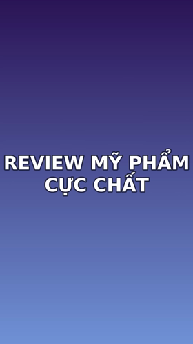

# Tab "Tự động hoá nâng cao (Affiliate Bot)"

Dán link video → Bot tự chạy 9 bước → ra video đã lồng tiếng Việt, có intro 3 giây và
nhạc nền mới, rồi tự mở thư mục kết quả.


## Quy trình 9 bước

```
1. Tải video nguồn              (yt-dlp - Douyin, RedNote, YouTube, TikTok...)
2. Tách giọng / nhạc nền        (Demucs)
3. Trích xuất lời thoại         (Faster-Whisper)
4. AI viết lại kịch bản TikTok  (Gemini / OpenAI / DeepSeek)
5. Phân tích cảm xúc & chọn nhạc
6. Lồng tiếng cảm xúc           (XTTS-v2)
7. Trộn âm thanh                (auto-ducking, nhạc -15dB)
8. Tạo intro 3 giây             (FFmpeg drawtext + zoompan)
9. Render video hoàn chỉnh
```

Mỗi bước có checkbox bật/tắt riêng. Tắt bước nào thì bước đó biến mất khỏi kế hoạch và
thanh tiến độ tự chia lại trọng số. Toàn bộ chạy trên `QThread` riêng nên giao diện không
đơ và bấm **Dừng** được bất cứ lúc nào.

---

## 1. Intro 3 giây

**Tự nhập**: gõ vào ô "Nội dung intro" (ví dụ `MẸO HAY MỖI NGÀY`, tên kênh của bạn).

**Để AI nghĩ hộ**: để trống ô đó và bật `[x] Tự động tạo Intro AI nếu để trống`. AI đọc
kịch bản rồi trả về một câu tối đa 5 từ, viết hoa (ví dụ `CỰC PHẨM MÓN ĂN`).

**Không có AI / AI lỗi**: Bot lấy câu thoại đầu tiên, cắt ngắn, viết hoa — không bao giờ
để intro trống.

Kỹ thuật: nền gradient (4 màu chọn được) → `drawtext` tự ngắt dòng và tự tính cỡ chữ theo
độ dài → `zoompan` phóng 1.0 → 1.12 → fade out 0.4 giây. Intro render đúng kích thước và
fps của video chính rồi mới `concat`, nên không bị lệch khung hay giật hình.



Cỡ chữ tính theo `width × 0.72 / (0.58 × số ký tự dòng dài nhất)` — chỉ dùng 72% bề ngang
vì zoompan sẽ phóng to và cắt bớt mép hai bên.

---

## 2. Nhạc nền

### App KHÔNG tải nhạc từ TikTok/Douyin

Nhạc trên TikTok được cấp phép **chỉ để dùng trong trình soạn thảo của TikTok**. Tải xuống
rồi mux vào file video là vi phạm bản quyền, và thực tế còn phản tác dụng: video dễ bị gỡ
tiếng hoặc dính strike hơn là được đẩy lên xu hướng.

### Hai cách hợp lệ

**Cách 1 — chọn file của bạn**: bấm "Chọn nhạc..." trỏ tới file bạn có quyền sử dụng.

**Cách 2 — thư viện royalty-free**: bỏ nhạc vào `assets/royalty_free_music/`, để trống ô
file nhạc. AI đọc kịch bản → đoán cảm xúc (Nhẹ nhàng / Sôi động / Hài hước / Buồn / Gây
cấn) → chọn file có tên khớp thể loại.

Đặt tên file có chứa từ khoá thể loại để khớp được (nút **AI gợi ý chủ đề nhạc** in ra
bảng này):

| Cảm xúc | Từ khoá đặt tên file |
|---|---|
| Nhẹ nhàng | `acoustic`, `lofi`, `piano` |
| Sôi động | `edm`, `pop`, `upbeat` |
| Hài hước | `ukulele`, `quirky`, `comedy` |
| Buồn | `piano`, `ambient`, `sad` |
| Gây cấn | `cinematic`, `epic`, `tension` |

So khớp bỏ dấu tiếng Việt, nên `nhac-buon-piano.mp3` vẫn khớp từ khoá `buồn`.

### Mix

Nhạc nền được hạ xuống **-15dB** (chỉnh được từ -40 đến 0) và đi qua `sidechaincompress`
lấy giọng đọc làm tín hiệu điều khiển — có thoại thì nhạc tự lùi xuống, hết thoại thì nhạc
trở lại. Nhạc ngắn hơn video sẽ tự lặp (`-stream_loop -1`).

---

## 3. Kịch bản AI & giọng đọc

Prompt gửi cho AI (giữ đúng nguyên văn bạn yêu cầu):

> Hãy đóng vai một Content Creator TikTok chuyên nghiệp. Viết lại lời dẫn (script) sau theo
> phong cách TikTok Việt Nam. Yêu cầu: Giọng điệu tự nhiên, gần gũi, có cảm xúc cao (hào
> hứng, ngạc nhiên, thân mật), sử dụng từ ngữ trending của Gen Z. Ngắn gọn súc tích nhưng
> vẫn đầy đủ thông điệp. Mục tiêu thu hút người xem dừng lại giây đầu tiên. Không dịch máy,
> hãy diễn đạt lại theo văn phong người Việt Nam đang nói chuyện trên mạng xã hội. Sử dụng
> dấu hỏi (?), dấu chấm than (!) và câu hỏi tu từ để giọng TTS khi đọc lên sẽ có nhịp điệu
> và cảm xúc.

**Một điều chỉnh quan trọng**: prompt được bổ sung ràng buộc trả về đúng số dòng theo định
dạng `n|nội dung`. Lý do: mỗi câu thoại gắn với một mốc thời gian trong video. Nếu để AI
viết lại thành một đoạn văn liền mạch, số câu thay đổi và toàn bộ giọng đọc sẽ lệch khỏi
hình. Viết lại **từng câu, giữ nguyên số câu** là cách duy nhất để giọng khớp hình.

Sau khi có kịch bản, mỗi câu được `ensure_punctuation()` bảo đảm có dấu kết (`.`, `?`,
`!`) rồi mới đưa vào XTTS-v2 — dấu câu chính là thứ cho TTS ngắt nhịp và lên xuống giọng.

Checkbox: `Tự động viết lại kịch bản AI`, `Lồng tiếng TTS thay thế giọng gốc`,
`Giữ lại phụ đề (.srt)`, `Nhái giọng nhân vật gốc`.

---

## 4. Đầu ra

```
<tên>.tiktok.mp4      video hoàn chỉnh (intro 3s + nội dung)
<tên>.vi.srt          phụ đề (nếu bật "Giữ lại phụ đề")
<tên>.script.txt      kịch bản đã viết lại
```

Xong là thư mục kết quả **tự mở**, kèm hộp thoại tóm tắt intro / cảm xúc / bài nhạc đã
dùng.

---

## Những gì app này không làm

Không có chức năng né phát hiện bản quyền (lật ảnh, đổi cao độ, jitter tốc độ, xoá
metadata) và không tải nhạc có bản quyền từ nền tảng khác. Các kỹ thuật đó không giúp kênh
sống lâu hơn — chúng chỉ làm chậm việc bị phát hiện, trong khi vẫn để lại đủ dấu vết cho
Content ID.

Muốn làm affiliate bền, hướng đi hiệu quả hơn là: xin phép creator gốc (nhiều người sẵn
sàng cho localize để lấy thêm view), dùng video do nhãn hàng cung cấp, hoặc tự quay phần
review của mình rồi dùng app này để lồng tiếng và làm phụ đề.

Bạn chịu trách nhiệm về quyền sử dụng video nguồn — app có ghi cảnh báo này ngay trên giao
diện.
